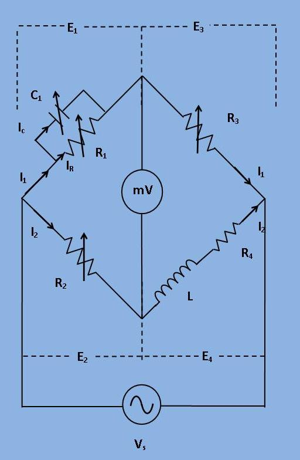
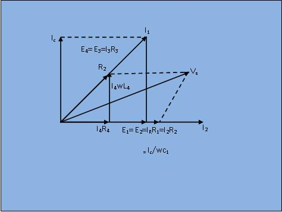

## Introduction

***Self-Inductance by Maxwell's Bridge***    In this bridge, an inductance is measured by comparison with a standard variable capacitance. The connection is shown in Figure 1.

***Figure 1: Circuit diagram for Maxwell's Bridge***

Here,
       L = Unknown Inductance,
       $R_4$ = Effective resistance of unknown Inductance coil,
       $R_1, R_2, R_3$ = Known non inductive resistance,
       $C_1$ = Standard variable capacitor.
        
       The balance equation for the branch can be written as: $$ (R_4 + j\omega L) * (\frac{R_1}{1 + j\omega C_1R_1}) = R_2R_3; $$ $$ R_1 R_4 + j\omega L R_1 = R_2 R_3 + j\omega R_2 R_3 C_1 R_1; $$
Equating the real and imaginary parts, $$ R_4 = \frac{R_2 R_3}{R_1} ...... (1)$$ $$ L = R_2 R_3 C_1 ...... (2)$$
    Two variables $R_1$ and $C_1$ which appear in one of the two balance equations (i.e. equation (1) and (2)) and hence the two equations are independent. The expression for Q factor can be written as: $$ Q = \frac{\omega L}{R_4} = \omega C_1 R_1 $$ Phasor Diagram:
    

***Figure 1: Circuit diagram for Maxwell's Bridge***

